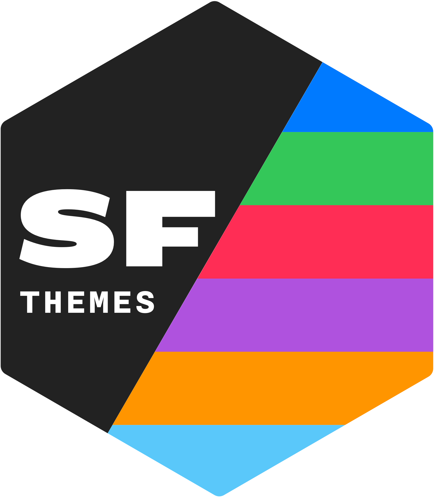
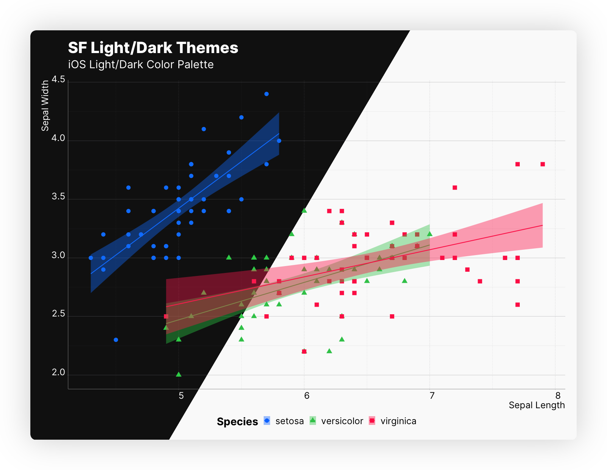
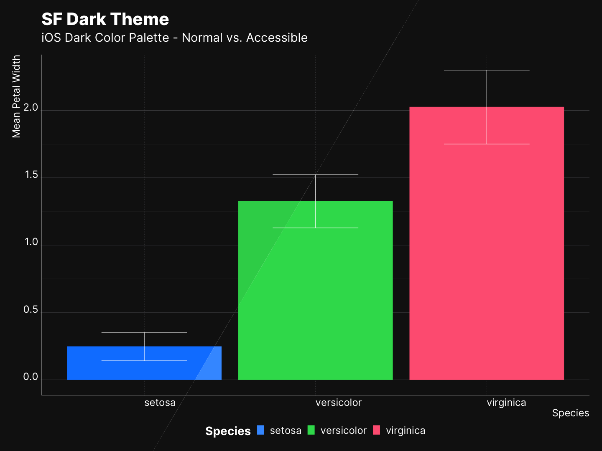

# San Francisco Themes <picture><source srcset="reference/figures/logo-light.png" media="(prefers-color-scheme: dark)"></picture>

sfthemes is a pair of [`ggplot2`](https://ggplot2.tidyverse.org) themes, `theme_sf_light()`, `theme_sf_dark()`, and a collection of color scales based on [Apple's Human Interface Guidelines](https://developer.apple.com/design/human-interface-guidelines/). Themes are inspired by the occasional appearances of charts used by Apple within different contexts, e.g., Apple Health app, Screen Time on iOS and macOS. And colors are adapted from iOS, macOS, and watchOS system colors. Each color scale has a light and dark variant as well that compliments the light/dark themes, `scale_colour_ios_light()` and `scale_colour_ios_dark()` respectively. 

When bond together, sfthemes offers a unique opportunity to generate two version of your plot, i.e., light/dark, with two *similar* but *individually* optimized color scales for each variant of your plot.

<picture>
    <source srcset="reference/figures/front-page-main.png" media="(prefers-color-scheme: dark)" class = "img-responsive center-block d-block mx-auto"/>
    
</picture>

In addition, sfthemes uses [dynamic type sizing](https://developer.apple.com/design/human-interface-guidelines/ios/visual-design/typography/) in order to provide a consistent and elegant overall resizing and re-scaling of plot elements. **Read more [here](articles/typography.html).**

## Install

Install the development version from GitHub

```R
install.packages("devtools"); library(devtools)
devtools::install_github("amirmasoudabdol/sfthemes")
```

Install from CRAN [Not available yet!]

```R
install.packages("sfthemes")
```

## Preparation / Usage

You can load and configure sfthemes using the following commands. If you do not get any errors or warnings, sfthemes is fully configured and can access the required fonts.

```R
library(ggplot2); library(sfthemes)

# You only need to run these commands once!
import_inter()
```

### Quick Start

sfthemes offers two base themes, `theme_sf_light()` and `theme_sf_dark()`. The Light theme uses an off-white background, `#fafafa`, and a range of black colors for text. In contrast, the dark theme uses an off-black background, `#141414`, and a range of white colors for text. In addition to themes, sfthemes provides a set of `scale_colour/fill_*` objects based on various available color palettes in Apple's platforms. Each color palette has a light and a dark variant, as well as an *accessible* form of those. Accessible color palettes are adjusted to have higher contrast and less brightness. A list of all available color palettes can be found [here](reference/index.html#section-palettes).

#### Light and Dark Themes

**In general, we recommend pairing light scales with light themes and dark scales with dark theme.** Here we use `scale_colour_ios_light()`, and `scale_colour_ios_dark()` to recreate the figure above.

```R
library(ggplot2); library(sfthemes)

gp <- ggplot(data = iris, aes(x = Sepal.Length, y = Sepal.Width, color = Species)) +
        geom_point(aes(shape = Species)) + 
        xlab("Sepal Length") + ylab("Sepal Width") +
        labs(title = "SF Light/Dark Themes", 
                subtitle = "iOS Light/Dark Color Palette") +
        geom_smooth(method="lm", aes(fill = Species))

# Light
gp + theme_sf_light(size_class = "xxxLarge") +
    scale_colour_ios_light(accessible = FALSE) +
    scale_fill_ios_light(accessible = FALSE) +
    theme(legend.position = "bottom")

# Dark
gp + theme_sf_dark(size_class = "xxxLarge") +
    scale_colour_ios_dark(accessible = FALSE) +
    scale_fill_ios_dark(accessible = FALSE) +
    theme(legend.position = "bottom")
```

| | |
|--|--|
| |  |

#### Accessible Colors

Each color palette is accompanied with an accessible variant of itself. In order to access the accessible color palettes, you can  use `accessible` parameter as follow. *The [Colors](articles/colours.html) article elaborates on the availability, differences, and features of each system color palette.*

```R
iris.sum <- iris %>%
    group_by(Species) %>%
    summarize(PW.mean= mean(Petal.Width),
                PW.sd = sd(Petal.Width))

gp <- ggplot(data = iris.sum, aes(x = Species)) +
        geom_bar(aes(y = PW.mean, fill = Species, color = Species), position = "dodge", stat = "identity") +
        geom_errorbar(aes(ymin = PW.mean - PW.sd, ymax = PW.mean + PW.sd), width = 0.5, position = position_dodge(width = 0.5), color = "black") + 
        labs(title = "SF Light Theme", subtitle = "iOS Light Color Palette - Normal vs. Accessible", y = "Mean Petal Width", x = "Species") 
# Normal
gp + theme_sf_light(size_class = "xxxLarge") +
    scale_colour_ios_light(accessible = FALSE) +
    scale_fill_ios_light(accessible = FALSE) +
    theme(legend.position = "bottom")

# Accessible
gp + theme_sf_light(size_class = "xxxLarge") +
    scale_colour_ios_light(accessible = TRUE) +
    scale_fill_ios_light(accessible = TRUE) +
    theme(legend.position = "bottom")
```

| | |
|--|--|
| |  |


#### Scaling

sfthemes provides 7 *size classes*, ie., scaling factors. Size classes can be applied to texts, elements, or both. The example below is generated from combination of light/dark plots and showcases all available size classes. *The [Size Classes](articles/colours.html) article elaborates on the dynamic type sizing.*

```R
size_class <- "Medium"

gp <- ggplot(data = iris, aes(x = Sepal.Length, y = Sepal.Width, color = Species)) +
        geom_point(aes(shape = Species)) + 
        xlab("Sepal Length") + ylab("Sepal Width") +
        labs(title = "SF Light/Dark Theme", 
                subtitle = paste0("Size Class: ", size_class) +
        geom_smooth(method="lm", aes(fill = Species))

# Light
gp + theme_sf_light(size_class = size_class) +
    scale_colour_ios_light(accessible = FALSE) +
    scale_fill_ios_light(accessible = FALSE) +
    theme(legend.position = "bottom")

# Dark
gp + theme_sf_dark(size_class = size_class) +
        scale_colour_ios_dark(accessible = FALSE) +
        scale_fill_ios_dark(accessible = FALSE) +
        theme(legend.position = "bottom")
```


- - -

## Misc.

#### Goals

The goal of sfthemes is to provide a pair of minimal and accessible light and dark themes. Moreover, sfthemes focus on bringing Apple’s system colors to ggplot2, as set of color and fill scales. Finally, sfthemes tries to incorporate modern typographical advancement into theme’s structure and aesthetic in order to guarantee an elegant visualization for different screen resolutions and sizes. 

#### Future Plan

While I will mainly focus on keeping sfthemes functional, I have a short list of features that I would like to implement if I find some times.

- Adding three *spacing classes* to control the spacing and margins of plots elements.
- Adding the SF Pro to themes, and using different variants of it for optimal readability in different *size classes*

#### Contribution

If you found any bugs, or have any suggestions, please feel free to reach out to me, either by opening an [issue](https://github.com/amirmasoudabdol/sfthemes/issues/) or a pull request, or dropping an email. 

#### Credits

I stared this project by cloning the amazing [hrbrthemes](https://hrbrmstr.github.io/hrbrthemes/), and along the way learned a lot from its coding style and methods. 

#### Support

Please let me know if you happen to use sfthemes. I would love to know how you are using it and whether you like it. 

Lastly, I quite like [ko-fi](https://ko-fi.com/C0C47DMK)! 😋

- - -

## Copyright Notice

Apple, the Apple logo, iPhone, iPad, Mac, Apple Watch, iOS, iPadOS, macOS, and watchOS are trademarks of Apple Inc., registered in the U.S. and other countries.
