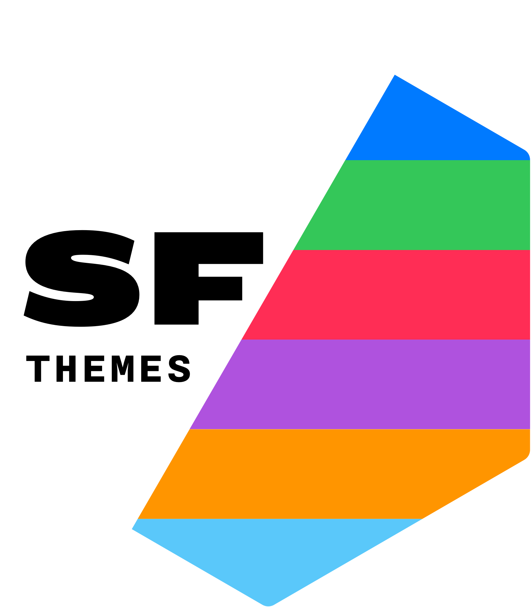

# San Francisco Themes <picture><source srcset="reference/figures/logo-dark.png" media="(prefers-color-scheme: dark)"></picture>

sfthemes is a collection of [`ggplot2`](https://ggplot2.tidyverse.org) themes, scales, and colors based on [Apple's Human Interface Guidelines](https://developer.apple.com/design/human-interface-guidelines/), and inspired by occasional appearances of charts used by Apple within different contexts, e.g., Apple Health app, Screen Time on iOS and macOS. In terms of typography, we optimized our themes to be compatible with [SF Pro](https://developer.apple.com/fonts/) and [Inter](https://rsms.me/inter/) typefaces. Additionally, we are using [dynamic type sizes](https://developer.apple.com/design/human-interface-guidelines/ios/visual-design/typography/) in order to provide consistent and elegant overall rescaling.

## Install

Install the development version from GitHub
```R
install.packages("devtools"); library(devtools)
devtools::install_github("amirmasoudabdol/sfthemes")
```

Install from CRAN [Not available yet!]
```R
install.packages("sfthemes")
```

## Preperation / Usage

You can load and configure sfthemes using the following commands. If you do not get any errors or warnings, sfthemes is fully configured and can access the required fonts.

```R
library(ggplot2); library(sfthemes)

# You only need to run these commands once!
import_inter()
import_sf_pro()
```

### Themes

sfthemes offers two base themes, `theme_sf_light()` and `theme_sf_dark()`. The Light theme uses an off-white background, `#fafafa`, and a range of black colors for text. In contrast, the dark theme uses an off-black background, `#141414`, and a range of white colors for text.

In addition to themes, sfthemes provides a set of `scale_color/fill_*` objects based on various available color palettes in Apple's HIG. Each color palette has a light and a dark variant, as well as accessible form of those. Accessible color palettes are adjusted to have higher contrast and less brightness. List of all available color palettes can be found [here].

In general, we recommend pairing light scales with `theme_sf_light` (or any other third-party light themes) and dark scales with `theme_sf_dark` theme (or any other third-party dark themes). 

**Example of `theme_sf_light` Theme**

```R
library(ggplot2); library(sfthemes)

ggplot(mtcars, aes(x = factor(vs), fill = factor(cyl), y = mpg)) +
    geom_dotplot(binaxis = "y", stackdir = "center", position = "dodge", color = NA) +
    labs(title = "San Francisco Dark Theme", subtitle = "using `scale_fill_ios_light`") +
    theme_sf_light() + scale_fill_ios_light()
```


**Example of `theme_sf_dark` Theme**

```R
library(ggplot2); library(sfthemes)

ggplot(mtcars, aes(x = factor(vs), fill = factor(cyl), y = mpg)) +
    geom_dotplot(binaxis = "y", stackdir = "center", position = "dodge", color = NA) +
    labs(title = "San Francisco Dark Theme", subtitle = "using `scale_fill_ios_dark`") +
    theme_sf_dark() + scale_fill_ios_dark()
```


#### Accessible Colors

Colors of every palette can be transformed to accessible colors by setting the `accessible` parameter to `TRUE`. For instnace:

```R
library(ggplot2); library(sfthemes)

ggplot(mtcars, aes(factor(cyl), mpg)) +
    geom_violin(aes(fill = factor(cyl)), color = NA) +
    labs(title = "San Francisco Dark Theme", subtitle = "using normal `scale_fill_ios_dark`") +
    theme_sf_dark() + scale_fill_ios_dark(accessible = F)
```


```R
library(ggplot2); library(sfthemes)

ggplot(mtcars, aes(factor(cyl), mpg)) +
    geom_violin(aes(fill = factor(cyl)), color = NA) +
    labs(title = "San Francisco Dark Theme", subtitle = "using *accessible* `scale_fill_ios_dark`") +
    theme_sf_dark() + scale_fill_ios_dark(accessible = F)
```


#### Scaling

sfthemes provides 7 scaling factor. Scaling factors can be applied to text, elements, or both.

```R
library(ggplot2); library(sfthemes)

ggplot(diamonds[sample(nrow(diamonds), 100), ], aes(carat, price)) +
    geom_point(aes(shape = cut, color = cut)) +
    labs(title = "Medium Overall Scaling") +
    theme_sf_light(scale = "Medium") + scale_color_ios_light()
```


```R
library(ggplot2); library(sfthemes)

ggplot(diamonds[sample(nrow(diamonds), 100), ], aes(carat, price)) +
    geom_point(aes(shape = cut, color = cut)) +
    labs(title = "Large Overall Scaling") +
    theme_sf_light(scale = "Large") + scale_color_ios_light()
```


```R
library(ggplot2); library(sfthemes)

ggplot(diamonds[sample(nrow(diamonds), 100), ], aes(carat, price)) +
    geom_point(aes(shape = cut, color = cut)) +
    labs(title = "Medium Text Scaling, Large Element Scaling") +
    theme_sf_light(font_size_scale = "Medium", element_size_scale = "xLarge") + 
scale_color_ios_light()
```


