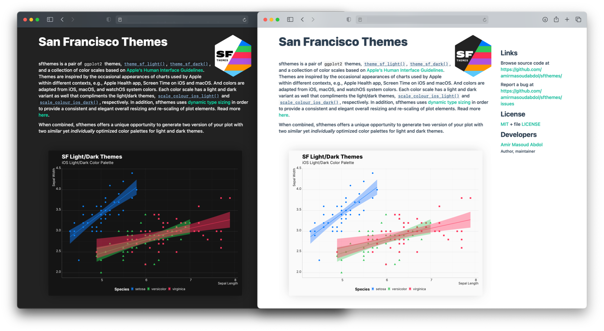

Nowadays, most modern web browsers can detect users system preferences and notify a website to deliver an accessible and customized experience to the visitors. Recently, I developed [preferebly](https://amirmasoudabdol.github.io/preferably) to take advantages of this, and customize `pkgdown` websites based on user's preferred system appearances, e.g., *light/dark mode*. However, background and text colors are not the only elements of a website that should be adjust based on users’ preferences, figures and plots should adapt their appearances as well. Fortunately, it is possible to provide two versions of a same image and inform browsers on when to use one instead of the other. For instance, as you can see below, a light themed plot is used in the light version of the website, and a dark themed plot in the dark version.



While changing the text and background color can be “easily” adjusted using CSS, creating two similar, compatible, and optimized plots for light and dark appearances is not straightforward. You need a set of light/dark theme, and a collection of compatible, and optimized color scales in order to be able to deliver a *seamless* experience. 

Here, I describe how you can achieve this behavior using my custom pkgdown template, [preferably](https://amirmasoudabdol.github.io/preferably), and sfthemes.

## Instruction

So, as I mentioned, what we need is two versions of the same plot, each optimized for light and dark appearance, and a method of delivering them based on the user’s system preference.

### Creating Light/Dark Plots

As shown [here](../../index.html#light-and-dark-themes), you can produce two variants of your visualization by using `theme_sf_light()` and `theme_sf_dark()` themes, and your selected color scheme in light and dark mode.

```R
library(ggplot2); library(sfthemes)

gp <- ggplot(aes(x = Sepal.Length,
                 y = Sepal.Width,
                 color = Species)) +
        geom_point(aes(shape = Species)) + 
        xlab("Sepal Length") + ylab("Sepal Width") +
        labs(title = "SF Light/Dark Themes", 
             subtitle = "iOS Light/Dark Color Palette") +
        geom_smooth(method="lm", aes(fill = Species))

# Light
gp + theme_sf_light(size_class = "xxxLarge") +
        scale_colour_ios_light(accessible = FALSE) +
        scale_fill_ios_light(accessible = FALSE) +
        theme(legend.position = "bottom")
ggsave("theme-sf-light.png")

# Dark
gp + theme_sf_dark(size_class = "xxxLarge") +
        scale_colour_ios_dark(accessible = FALSE) +
        scale_fill_ios_dark(accessible = FALSE) +
        theme(legend.position = "bottom")
ggsave("theme-sf-dark.png")

```

| | |
|--|--|
| |  |

### Markdown Integration

Now that we have our plots, we can use HTML’s [`<picture>` and `<source>`](https://www.w3schools.com/TAgs/att_source_srcset.asp) tags and set a different image to `` based on website's appearance. For example, the code block below makes sure that `theme-sf-dark.png` will be the source when the user seeing a dark version of the website.

```html
<picture>
    <source srcset="reference/figures/theme-sf-dark.png" media="(prefers-color-scheme: dark)"/>
    
</picture>
```

Don't be alarmed by the use of HTML, you don’t necessarily need to edit your HTML files, in fact, you can just write this inside your markdown files. Most Markdown parsers are smart enough to detect this as a piece of HTML code, and simply inject it into the rendered HTML. For instance, you can see that [this page](https://github.com/amirmasoudabdol/sfthemes/blob/main/vignettes/dynamic_light_and_dark_plots_in_web.Rmd) is generated using from a markdown file, using `rmarkdown`.

The figure below is created using the above snippet, and will change based on your preference.

<picture>
    <source srcset="../reference/figures/front-page-sample-dark.png" media="(prefers-color-scheme: dark)"/>
    
</picture>
