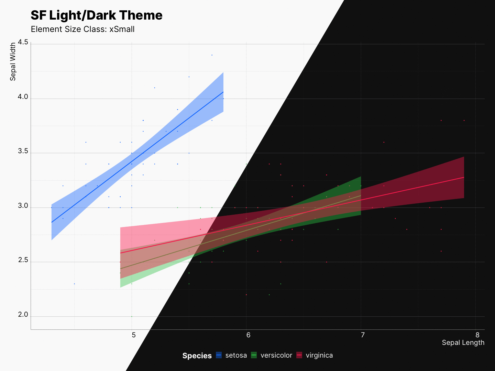
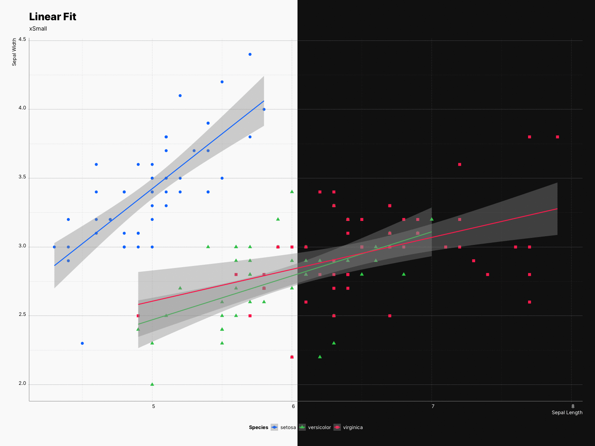
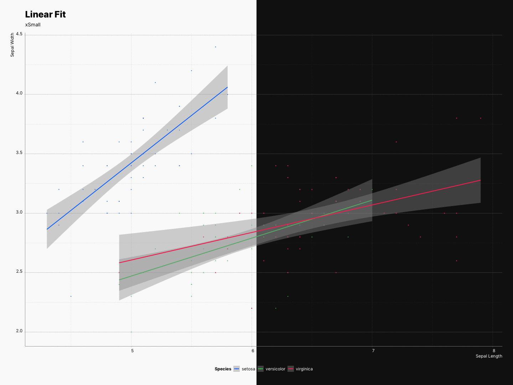

Besides dynamic type sizing, sfthemes can also scale all other elements of the plot. This is being done by multiplying all element sizes with a specific multiplier. 

| class      | `xSmall` | `Small` | `Medium` | `Large` | `xLarge` | `xxLarge` | `xxxLarge` |
| ---        | ---    | ---   | ---    | ---   | ---    | ---     | ---      |
| multiplier | `0.75`   | `1`     | `1.25`   | `2`    | `3`      | `4`       | `5`        |

In contarst to [ggplot2::ggsave()](https://ggplot2.tidyverse.org/reference/ggsave.html) where you are only able to scale your 
elements, as mentioned, sfthemes can scale fonts, elements, or both at the same 
time. Moreover, the rescaling effect can be previewed as you experiment with your plot.

⚠️ Keep in mind that these values will scale the existing sizes of each elements; therefore, it is recommended that you do not try to scale your entire plot if you are using `size` or `lwd` as one of your `aes`.

## Scaling element sizes

```R
# TODO: Update the code when the plot is finalized
```



## Scaling font sizes

```R
# TODO: Update the code when the plot is finalized
```




## Scaling everything together

```R
# TODO: Update the code when the plot is finalized
```


