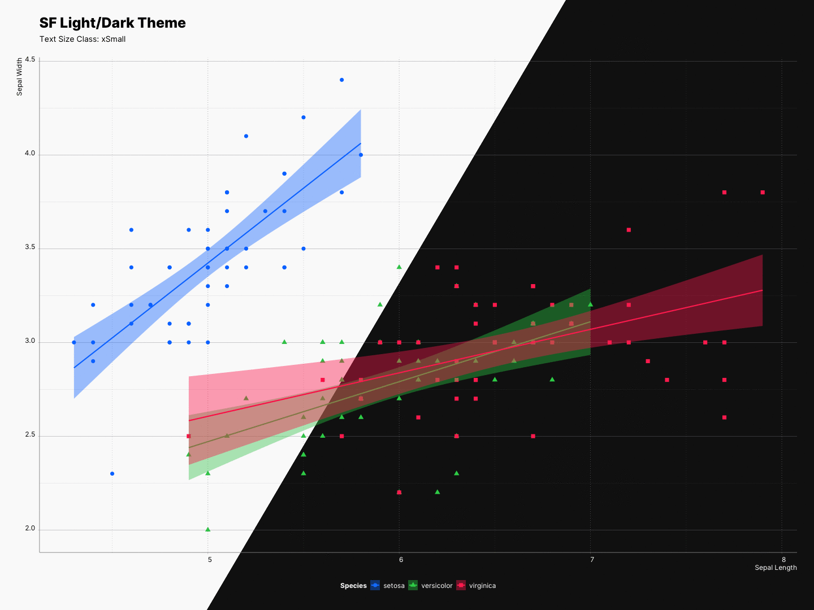

Besides dynamic type sizing, sfthemes can also scale all other elements of the plot. This is being done by multiplying all element sizes with a specific multiplier. 

| class      | `xSmall` | `Small` | `Medium` | `Large` | `xLarge` | `xxLarge` | `xxxLarge` |
| ---        | ---    | ---   | ---    | ---   | ---    | ---     | ---      |
| multiplier | `0.75`   | `1`     | `1.25`   | `2`    | `3`      | `4`       | `5`        |

In contrast to [ggplot2::ggsave()](https://ggplot2.tidyverse.org/reference/ggsave.html) where you are only able to scale your 
elements, as mentioned, sfthemes can scale fonts, elements, or both at the same time. Moreover, the re-scaling effect can be previewed as you experiment with your plot.

⚠️ Keep in mind that these values will scale the existing sizes of each elements; therefore, it is recommended that you do not try to scale your entire plot if you are using `size` or `lwd` as one of your `aes`.

## Scaling element sizes

By using the `element_size_class` parameter, we can control the scaling of the **elements**. 

```R
size_class <- "Medium"

gp <- ggplot(iris, aes(x = Sepal.Length, 
                       y = Sepal.Width,
                       color = Species)) +
        geom_point(aes(shape = Species)) + 
        xlab("Sepal Length") + ylab("Sepal Width") +
        labs(title = "SF Light/Dark Theme", 
             subtitle = paste0("Size Class: ", size_class) +
        geom_smooth(method="lm", aes(fill = Species))

# Light
gp + theme_sf_light(element_size_class = size_class) +
        scale_colour_ios_light(accessible = FALSE) +
        scale_fill_ios_light(accessible = FALSE) +
        theme(legend.position = "bottom")

# Dark
gp + theme_sf_dark(element_size_class = size_class) +
        scale_colour_ios_dark(accessible = FALSE) +
        scale_fill_ios_dark(accessible = FALSE) +
        theme(legend.position = "bottom")
```


## Scaling font sizes

By using the `font_size_class` parameter, we can control the scaling of the **fonts**.

```R
size_class <- "Medium"

gp <- ggplot(iris, aes(x = Sepal.Length, 
                       y = Sepal.Width,
                       color = Species)) +
        geom_point(aes(shape = Species)) + 
        xlab("Sepal Length") + ylab("Sepal Width") +
        labs(title = "SF Light/Dark Theme", 
             subtitle = paste0("Size Class: ", size_class) +
        geom_smooth(method="lm", aes(fill = Species))

# Light
gp + theme_sf_light(font_size_class = size_class) +
        scale_colour_ios_light(accessible = FALSE) +
        scale_fill_ios_light(accessible = FALSE) +
        theme(legend.position = "bottom")

# Dark
gp + theme_sf_dark(font_size_class = size_class) +
        scale_colour_ios_dark(accessible = FALSE) +
        scale_fill_ios_dark(accessible = FALSE) +
        theme(legend.position = "bottom")
```



## Scaling everything together

By using the `size_class` parameter, we can control the scaling of both the 
**elements**, and **fonts**.

See [readme](../../index.html) for the code.


