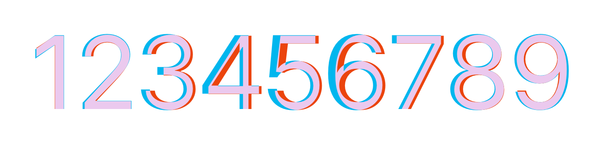
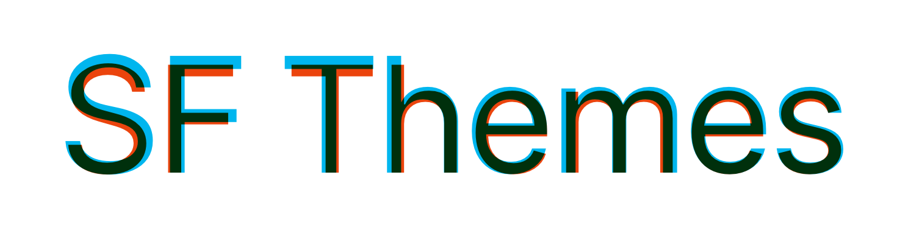

Both themes are compatible with [SF Pro](https://developer.apple.com/fonts/) and [Inter](https://rsms.me/inter/) typefaces. While I was hoping to fully utilize SF Pro family — due to licensing and rendering/compatibility issues — I opt for [Inter](https://rsms.me/inter/) as the primary font family of the package. 

## Inter, The Alternative

Inter is a [free and open source](https://github.com/rsms/inter) typeface, and you are free to use it in almost any way imaginable. Inter is closely related to SF Pro. Like SF Pro, it is crafted and designed for computer screens, therefore sfthemes plots with Inter fonts will look a lot like their SF Pro variants.

**Inter vs SF Pro**

### Usage

Inter is the **default** typeface of the sfthemes, and it can be used without 
setting any special commands. However, if you are interested in using Inter
with other themes, you can use the `sf_set_inter` function to replace default 
font of any themes to Inter. See the documentation of [`sf_set_inter()`](../reference/sf_set_font.html) for more
details.

## San Francisco Family

[San Francisco typeface](https://en.wikipedia.org/wiki/San_Francisco_(sans-serif_typeface)) consists of three large family of typefaces, SF Pro, SF Compact, and SF Mono. They are designed to be used in different Apple platforms, e.g., iOS, macOS. Each family has its own characteristic and is optimized for certain screen size and resolution. sfthemes is optimized for SF Pro, the most general variant of the typeface designed for iOS, iPadOS, and macOS. 

Apple restricted the usage of the entire SF typeface family for developers who are designing and developing applications or material for Apple's platforms. Please keep this restriction in mind when using and sharing your plots, if you are using SF Pro as the main typeface of the plots. Moreover, distribution and repackaging of the San Francisco family is prohibited, therefore I cannot include the font in the package. However, the fonts can be downloaded freely from Apple's website. [Download SF Pro](https://developer.apple.com/fonts/).

### Usage

⚠️ *SF Pro is not yet fully implemented, but I'm working on fixing a few bugs and making the font available at least on macOS!*

## Custom Font Families

Besides Inter (and SF Pro), sfthemes allows you to **seamlessly** patch the entirety of any themes with your custom font. Read more on `sf_set_custom_font()` documentation.

## Dynamic Type Sizes

sfthemes has adjusted and adapted all available [dynamic type sizes](https://developer.apple.com/design/human-interface-guidelines/ios/visual-design/typography#dynamic-type-sizes) as presented in Apple's HIG. sfthemes size classes are based on iOS font sizes with minor compatibility modifications. In total, there are 7 size classes available — i.e., `xSmall`, `Small`, `Medium`, `Large`, `xLarge`, `xxLarge`, `xxxLarge` — with `Medium` being the default class.

### Usage

Both `theme_sf_light()` and `theme_sf_dark()` are accompanied with there scaling parameters, `size_class`, `font_size_class`, and `element_size_class`. Setting either of the parameters to any of the aforementioned size classes will
scale all the elements to desired class. More detail can be found in [size classes](size_classes.html) article.
